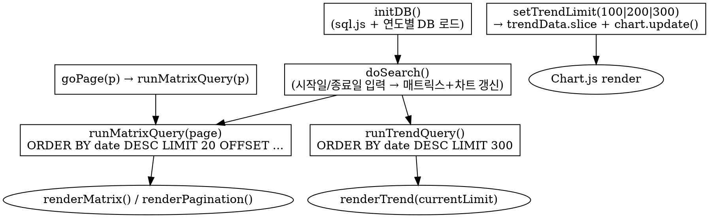

# 나라장터 예가율 분석 대시보드 — 설계

- 작성일: 2026-05-04
- 대상 산출물: `html/g2b_ratio.html` (신규), `html/js/topbar.js` (메뉴 추가)

## 1. 배경 / 목적

기존 `html/g2b_detail.html`은 한 건의 공고를 클릭해야 해당 공고의 예비가격 15개와 기초금액 대비 비율을 모달로 확인할 수 있다. 다수 공고 사이의 비율 패턴 비교와 예가율 추세 관찰이 어렵다.

본 대시보드는 다음 두 뷰를 한 페이지에 제공한다.

1. **예비가격 비율 매트릭스** — 기간 내 공고들의 예비가격 1~15번이 기초금액 대비 몇 % 인지를 한 표에서 가로로 비교.
2. **예가율 추이 차트** — 최근 100/200/300건의 예가율(예정가격 ÷ 기초금액 × 100) 변화를 시간순 라인 차트로 시각화.

## 2. 요구사항 (확정)

| ID | 항목 | 결정 |
|----|------|------|
| R1 | 위치 | 신규 페이지 `html/g2b_ratio.html`. `topbar.js` 메뉴에 항목 추가. |
| R2 | 검색 패널 | 시작일 / 종료일 두 필드만. 공고번호/공고명/업무구분 필터 없음. |
| R3 | 매트릭스 표시 | 페이지네이션. 페이지당 20건의 공고. |
| R4 | 매트릭스 구조 | 1열 = 행 라벨(1~15), 2열~ = `<bid_pbanc_no>-<bid_pbanc_ord>` (재공고 구분). 셀 값 = `rsve_price_N / base_amount × 100` (소수점 2자리). |
| R5 | 차트 | 단일 Chart.js Line, `[100][200][300]` 토글 버튼으로 표시 건수 전환. |
| R6 | 정렬 | DB 조회: `ORDER BY date DESC, bid_pbanc_no DESC`. 차트 표시는 reverse하여 시간 오름차순(왼쪽=과거 → 오른쪽=최신). |
| R7 | 차트 X축 | 공고번호 라벨, `autoSkip: true` + `maxTicksLimit: 20`. 호버 툴팁에 공고번호 + 날짜 + 예가율. |
| R8 | 컴포넌트 재사용 | `db_preloader.js`, sql.js 로직, 페이지네이션 CSS/JS, 로딩 스피너, `ratio()`/`fmt()` 유틸을 `g2b_detail.html`에서 그대로 채택. |

## 3. 화면 레이아웃

```
┌─ topbar ────────────────────────────────────────┐
│ <h1>나라장터 예가율 분석</h1>                      │
│                                                  │
│ ┌─ search-panel ─────────────────────────┐       │
│ │ [시작일] [종료일] [검색] [초기화]          │       │
│ └─────────────────────────────────────────┘       │
│ "총 N건"                                          │
│                                                  │
│ ── 섹션 1: 예비가격 비율 매트릭스 ──                 │
│ ┌──────┬───────┬───────┬─── ... 20열 ──┐         │
│ │ 구분 │ 공고1 │ 공고2 │  ...           │         │
│ │  1   │ 99.43 │ 99.31 │                │         │
│ │ ...  │       │       │                │         │
│ │ 15   │100.62 │100.81 │                │         │
│ └──────┴───────┴───────┴────────────────┘         │
│ [<<][<][1][2]...[>][>>]                          │
│                                                  │
│ ── 섹션 2: 예가율 추이 ──                          │
│ [최근 100] [200] [300]                           │
│ ┌────────────────────────────────────────┐        │
│ │  Line Chart (Y: 예가율%, X: 공고번호)    │        │
│ └────────────────────────────────────────┘        │
└──────────────────────────────────────────────────┘
```

## 4. 데이터 흐름



핵심 최적화:
- **차트는 한 번만 쿼리**한다(`LIMIT 300`). 토글은 메모리에서 `slice(0, limit)` + `chart.update()`로 처리해 추가 쿼리 없음.
- 연도별 DB 분할은 `g2b_detail.html`의 누적 분배 패턴을 재사용한다(`yearOutOfRange`, 페이지 카운트 누적 합산).

## 5. 컴포넌트 분해

### 5.1 신규 파일: `html/g2b_ratio.html`

| 함수 | 책임 |
|------|------|
| `initDB()` | sql.js 초기화, `getAllG2bYearDbs()`로 연도 DB 로드, `years = DESC`, 인덱스 생성, 로딩 스피너 제거. (g2b_detail와 동일) |
| `buildWhere()` | 날짜 두 필드만 처리해 `whereClause` + `params` 반환. `YYYY-MM-DD` → `YYYY/MM/DD` 변환. |
| `doSearch()` | `runMatrixQuery(1)` + `runTrendQuery()` 동시 호출. |
| `runMatrixQuery(page)` | 연도별 카운트 합산 → 글로벌 페이지 컷 분배 → 행 수집. (g2b_detail의 `runQuery` 패턴) |
| `renderMatrix(rows)` | 헤더 행에 공고번호, 행 1~15에 비율 셀. 결과 0건이면 "결과 없음" 메시지. |
| `renderPagination()` | 기존 페이지네이션 함수 그대로 복사. `goPage(p) → runMatrixQuery(p)`. |
| `runTrendQuery()` | 동일 WHERE + `LIMIT 300`. 결과를 `trendData` 캐시에 저장. |
| `setTrendLimit(limit)` | 토글 버튼 핸들러. `currentLimit = limit` → `renderTrend()`. 가용 데이터 < limit인 버튼은 `disabled`. |
| `renderTrend()` | `trendData.slice(0, currentLimit)` → `reverse()`(시간 오름차순) → Chart.js dataset 갱신. 첫 호출은 `new Chart()`, 이후는 `chart.update()`. |
| `ratio(a, b)`, `fmt(n)`, `decodeHtml(s)` | g2b_detail와 동일. |

### 5.2 변경 파일: `html/js/topbar.js`

메뉴 배열에 한 줄 추가: `{ name: '예가율 분석', href: 'g2b_ratio.html' }`. 정확한 위치는 구현 단계에서 기존 메뉴 순서를 본 뒤 결정한다.

## 6. SQL 쿼리

매트릭스 쿼리(연도별로 분배 실행):

```sql
SELECT bid_pbanc_no, bid_pbanc_ord, base_amount,
       rsve_price_1, rsve_price_2, ..., rsve_price_15
FROM bid_results
WHERE date >= :dateFrom AND date <= :dateTo
ORDER BY date DESC, bid_pbanc_no DESC
LIMIT :limit OFFSET :offset
```

차트 쿼리:

```sql
SELECT bid_pbanc_no, date, base_amount, predict_price
FROM bid_results
WHERE date >= :dateFrom AND date <= :dateTo
ORDER BY date DESC, bid_pbanc_no DESC
LIMIT 300
```

`predict_price / base_amount * 100`을 클라이언트에서 계산. 차트 X축 라벨은 매트릭스와 동일하게 `<bid_pbanc_no>-<bid_pbanc_ord>` 결합 문자열을 사용한다(재공고가 같은 X 위치에 겹치는 것 방지). `autoSkip`으로 화면에는 일부 라벨만 표시하고, 호버 툴팁에서는 전체 문자열 + 날짜 + 예가율을 보여준다.

## 7. 오류 / 엣지 케이스

| 케이스 | 동작 |
|--------|------|
| 검색 결과 0건 | 매트릭스 영역에 "결과 없음" 메시지, 차트 영역 숨김(`display: none`). |
| 결과가 100건 미만 | `[200][300]` 버튼은 `disabled`. 가용 건수만큼 표시. |
| `base_amount`가 0 또는 null | 매트릭스 셀에 `-` 표시 (기존 `ratio()` 동작 유지). 차트 데이터에서는 해당 포인트 제외. |
| 페이지 번호가 범위 밖 | `goPage()` early return (g2b_detail와 동일). |
| sql.js 로딩 실패 | `console.warn` + 로딩 스피너 그대로 둠 (기존 패턴). |
| 날짜 입력이 비어 있음 | 기본값: 종료일 = 오늘, 시작일 = 빈값(전체 기간). |

## 8. 비기능 요구

- 페이지 진입 시 sql.js + DB 로딩은 `g2b_detail.html`과 같은 시간(예비 측정: ~2-3초). 추가 비용 없음.
- 매트릭스 페이지 전환은 메모리 쿼리만이라 100ms 내 응답.
- 토글은 메모리 slice + `chart.update()`로 즉시 반영.
- Chart.js 인스턴스는 1개만 유지(다른 토글로 교체 시 destroy 후 재생성하지 않고 dataset만 교체).

## 9. 비범위 (YAGNI)

다음은 본 작업에서 구현하지 않는다.

- 업무구분(`prcm_bsne_se_cd`) 필터링.
- 공고번호 / 공고명 텍스트 검색.
- CSV / 이미지 내보내기.
- 매트릭스 셀 색상 그라데이션(히트맵).
- 차트 하단의 통계 요약(평균/표준편차).
- 모바일 반응형 레이아웃 최적화.

후속 요구사항이 들어오면 별도 spec으로 분리한다.

## 10. 검증 방법

- 페이지 로드 후 기본 검색이 자동 실행되어 매트릭스/차트가 모두 그려진다.
- 시작일/종료일을 좁혀 검색 시 결과 건수와 페이지 수가 일관되게 갱신된다.
- 페이지 버튼 이동 시 매트릭스가 교체되고 차트는 그대로 유지된다.
- `[100]/[200]/[300]` 토글 시 차트만 갱신되고 매트릭스는 그대로 유지된다.
- 결과 0건 / 결과 < 100건 케이스에서 메시지/disabled 동작 확인.
- `topbar.js`에서 새 메뉴 항목 클릭 → 본 페이지 이동, 다른 페이지에서도 메뉴가 정상 노출.
