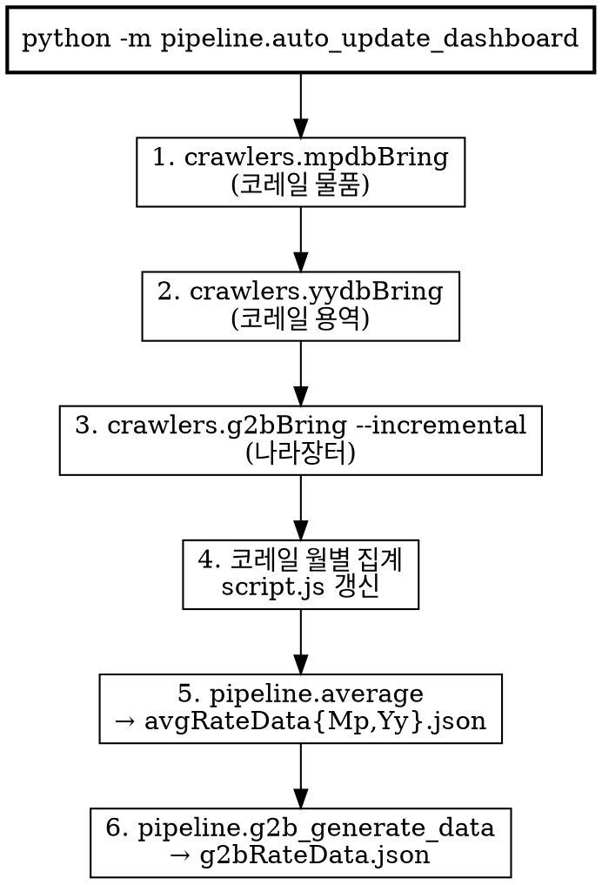

# 데이터 파이프라인 — 통합 자동화 설계

- 작성일: 2026-05-10
- 대상: `pipeline.auto_update_dashboard` (모든 크롤/집계의 단일 진입점)
- 베이스 여부: 본 문서가 데이터 파이프라인의 **첫 번째(base) 디자인 문서**. 이후 변경은 `{날짜}-data-pipeline-design.md` 로 누적 차분 문서를 추가한다.

## 1. 배경 / 목적

기존에는 데이터 출처마다 별도 명령을 실행해야 했다.

| 출처 | 옛 명령 |
|------|---------|
| 코레일 물품/용역 | `python -m pipeline.auto_update_dashboard` (mp/yy 만 처리) |
| 나라장터 (g2b) | `python -m crawlers.g2bBring` 별도 |
| 나라장터 비율 JSON | `python -m pipeline.g2b_generate_data` 별도 |

운영 시 손이 많이 가고, 한 출처 갱신을 빠뜨리면 대시보드 페이지별 최신성이 어긋났다.

## 2. 설계 원칙

- **한 명령으로 끝낸다.** 일상 운영은 `python -m pipeline.auto_update_dashboard` 만 실행하면 코레일 + 나라장터 모두 최신화된다.
- **나라장터는 항상 증분.** 매번 4/1~오늘 전체 재스캔은 비현실적. DB 의 `MAX(date)` 부터만 크롤하고, PK 충돌은 G2bDB 가 자동으로 무시한다.
- **선택적 비활성화.** 부분 운영(코레일만, JSON 재생성만)도 한 명령에서 플래그로 가능.
- **한 줄 변경으로 윈도우 GUI 도 동시에 반영.** `run_update.bat` 가 `python -m pipeline.auto_update_dashboard` 를 그대로 호출하므로 batch 메뉴도 자동으로 통합 동작한다.

## 3. 단일 명령의 6단계



순서가 가지는 의미:
- 1·2·3 은 외부 사이트 크롤 (셀레니움/HTTP). 1·2 와 3 은 독립이라 순서 자체에는 의미가 없지만, 직렬 실행으로 관찰성·중간 종료 시 디버깅을 단순화한다.
- 4·5 는 코레일 DB → 정적 자산 (`script.js`, JSON). 1·2 가 끝나야 의미 있는 결과가 나온다.
- 6 은 나라장터 DB → JSON. 3 이 끝나야 의미 있다.

## 4. 플래그 정의

| 플래그 | 1 | 2 | 3 | 4 | 5 | 6 |
|--------|---|---|---|---|---|---|
| (없음) | ✓ | ✓ | ✓ | ✓ | ✓ | ✓ |
| `--no-crawl` | ✗ | ✗ | ✗ | ✓ | ✓ | ✓ |
| `--no-g2b` | ✓ | ✓ | ✗ | ✓ | ✓ | ✗ |
| `--no-crawl --no-g2b` | ✗ | ✗ | ✗ | ✓ | ✓ | ✗ |
| `--year YYYY` | — | — | — | YYYY 적용 | YYYY 적용 | — |

`--year` 는 코레일 집계의 대상 연도만 바꾼다. 나라장터는 모든 연도 DB(`db/g2b_*.db`)를 합산하므로 연도 옵션이 없다.

## 5. 증분 모드 (`crawlers.g2bBring --incremental`)

```python
def _max_date_in_dbs(db_dir):
    # db/g2b_*.db 모두 순회하여 MAX(date) 중 최댓값 반환
```

`--incremental`:
- DB 에 데이터가 있으면 `start_date = MAX(date)` (해당 일자부터 재스캔 — late insert 누락 방지)
- DB 가 비어 있으면 최근 7일
- `end_date = today`

PK = `(bid_pbanc_no, bid_pbanc_ord, bid_clsf_no)`. 같은 날 일부 항목이 중복으로 다시 스캔되더라도 PK 충돌로 자동 skip.

## 6. 핵심 컴포넌트 책임

| 모듈 | 책임 | 진입 방식 |
|------|------|-----------|
| `pipeline.auto_update_dashboard` | 6단계 오케스트레이션, 플래그 해석, subprocess 호출 | `python -m`, `run_update.bat`, `pipeline.scheduled_update` |
| `pipeline.scheduled_update` | Windows 작업 스케줄러용 wrapper. `os.chdir(project_root)` 후 자동화 호출 | Task Scheduler |
| `pipeline.average` | 코레일 DB → `avgRateData{Mp,Yy}.json` (10일 단위 평균 예가율) | `--year` 인자 |
| `pipeline.g2b_generate_data` | 나라장터 DB 합산 → `g2bRateData.json` (16밴드 × 12개월) | 인자 없음 |
| `crawlers.mpdbBring` / `crawlers.yydbBring` | 코레일 e-bid 크롤 → `priceDB.db` / `yongyuk.db` | 모듈 호출 |
| `crawlers.g2bBring` | 나라장터 g2b 크롤 → `db/g2b_<year>.db` | `--incremental` (자동화 경로) / `--test` (수동) |

`DashboardAutomator.run_module(module_name, args)` 가 모든 subprocess 호출을 통일 (`python -m <module>`, `cwd=project_root`).

## 7. 운영 시나리오

| 상황 | 권장 명령 |
|------|-----------|
| 일상 갱신 | `python -m pipeline.auto_update_dashboard` |
| 윈도우 더블클릭 | `run_update.bat` → 메뉴 1 |
| 데이터 검증/실험 (크롤 없이 재집계만) | `--no-crawl` |
| 나라장터 사이트 점검 중 | `--no-g2b` |
| 과거 연도 코레일 재집계 | `--year 2024 --no-crawl` |
| 특정 날짜 g2b 만 보강 | `python -m crawlers.g2bBring --test --test-date YYYYMMDD --test-end-date YYYYMMDD` |

## 8. 비기능 요구

- 일상 갱신 (코레일 ~10분 + g2b 증분 1~5분) 합계 15분 이내 목표.
- 한 단계 실패가 다음 단계를 막지 않음 (현재 코드는 ⚠️ 경고 후 진행).
- subprocess `cwd=project_root` 고정으로 상대 경로 (`db/`, `html/`) 일관성 유지.

## 9. 비범위 (YAGNI)

- 병렬 크롤 (mp/yy/g2b 동시 실행) — 셀레니움 인스턴스 충돌 위험.
- 자동 재시도 / 백오프.
- 크롤 결과 diff 알림 (Slack/이메일).
- DB 마이그레이션/스키마 버전 관리.

## 10. 검증

- `python -m pipeline.auto_update_dashboard --no-crawl` → 1·2·3 스킵, 4·5·6 모두 ✅ (가벼운 회귀 테스트).
- `python -m pipeline.auto_update_dashboard` → 6단계 모두 실행, 종료 후 git diff 로 DB/JSON 갱신 확인.
- `python -m crawlers.g2bBring --incremental` 단독 실행 시 시작일이 DB MAX(date) 와 일치하는지 stdout 의 "수집 기간" 라인 확인.
